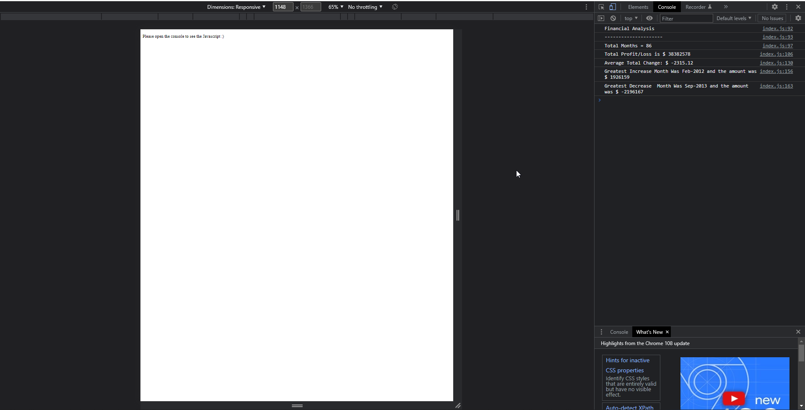
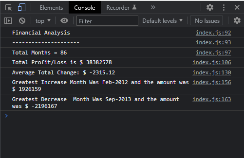

# Console Finances

## Financial records analysis using Javascript

This project was created in order to analyse a list of financial data (a series of months with the amount of money made/lost in that month) using Javascript.

By using Javascript to analyse the code this will allow the values to be easily updated if more values were to be added to the list. It also means that if the client wanted the data to be displayed on a website in an interactive form for potential customers/business partners/investors to see, not only could the data easily be updated but I could add html and css in order to style it and create a visually clear and interactive experience for the viewer.

By using Javascript to interact with the array of data and outputting the exact information needed, this solves the problem of having to manually search through the list of data and calculate everything ourselves. In essence, it automates the process and makes things easier for us. It also circumvents the need to outsource or use an external program such as Excel, as it is possible to do these calculations within the browser by directly interacting with the array.

This project allowed me to increase my understanding of Javascript, I now understand much better how for loops and the if/ else if statements work. In addition, I understand how to apply logical thinking to problem solving and applying my knowledge of JavaScript to a real-world problem. I also learned how to use toFixed in order to round a value to the 2nd decimal place.

## Installation

N/A

## Usage

In order to view the financial analysis, please open the deployed application in your browser and access the console.
On Google Chrome, this can be done by right clicking, selecting "Inspect" and then clicking "Console" at the top on the right hand side.

In the console you will be able to view the financial analysis, which has been printed to the console and will show the results of the calculations.

In order to view the application, please visit the deployed application link here:

https://psychicsalad.github.io/Console-Finances/

In order to view the repository, please visit:

https://github.com/PsychicSalad/Console-Finances

(This will allow you to see the Javascript code itself.)

These screenshots show the console open on the webpage which displays the financial analysis:

## License

This project uses an MIT license. Please view the license file for details.
